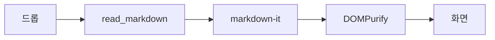

# markview 검증 픽스처

이 문서는 프로토타입이 붙었는지 눈으로 확인하기 위한 것입니다. 맨 위 frontmatter 블록(`---`로 둘러싸인 title/tags)이 **화면에 보이면 실패**입니다.

## 목차 확인용 앵커

- [GFM 확장](#gfm-확장)
- [코드 하이라이팅](#코드-하이라이팅)
- [이미지](#이미지)
- [mermaid](#mermaid)

## GFM 확장

| 항목 | 상태 | 비고 |
| --- | --- | --- |
| 테이블 | 됨 | 이 표가 테두리와 함께 보이면 성공 |
| 취소선 | 됨 | ~~이 문장에 줄이 그어져야 합니다~~ |
| 체크박스 | 됨 | 아래 목록 참고 |

- [x] 완료된 항목 — 체크된 상자로 보여야 합니다
- [ ] 미완료 항목 — 빈 상자로 보여야 합니다
- [ ] `- [ ]` 라는 생 텍스트가 보이면 실패입니다

인라인 raw HTML도 통과해야 합니다: 줄바꿈<br />다음 줄.

<details>
<summary>접힌 영역 — 클릭해서 펼쳐지면 raw HTML이 살아 있는 것</summary>

접힌 안쪽 내용입니다. DOMPurify가 `details`/`summary`를 지우지 않았다는 뜻입니다.

</details>

<script>document.body.innerHTML = "sanitize 실패";</script>

위 줄에 `script` 태그가 있었습니다. 이 문장이 그대로 보이고 화면이 망가지지 않았다면 sanitize가 동작한 것입니다.

## 코드 하이라이팅

```typescript
interface Document {
  path: string;
  text: string;
}

const open = async (path: string): Promise<Document> =>
  invoke<Document>("read_markdown", { path });
```

```rust
#[tauri::command]
fn read_markdown(app: AppHandle, path: String) -> Result<Document, String> {
    let p = PathBuf::from(&path);
    if p.is_dir() {
        return Err("폴더는 열 수 없습니다".into());
    }
    Ok(Document { path, text: std::fs::read_to_string(&p).unwrap() })
}
```

```css
:root {
  --bg: #ffffff;
  --fg: #1f2328;
}
```

세 블록 모두 색이 입혀져야 합니다. 색 없이 검은 글씨면 highlight.js가 안 걸린 것입니다.

## 이미지

같은 폴더의 이미지가 아래에 보여야 합니다. 깨진 아이콘이면 asset protocol 배선이 실패한 것입니다.


## 링크

- [외부 링크 — tauri.app](https://tauri.app) → 기본 브라우저가 열리고 이 창은 그대로 있어야 합니다
- [상대 문서 링크](./other.md) → 1of3에서는 아무 일도 일어나지 않습니다 (2of3에서 새 탭)
- [맨 위로](#markview-검증-픽스처) → 문서 최상단으로 스크롤되어야 합니다

## mermaid

아래 블록은 1of3에서는 **코드블록 그대로** 보이는 것이 정상입니다. 3of3에서 다이어그램으로 바뀝니다.



## 긴 본문

아래는 스크롤 위치 보존을 확인하려고 넣은 여백입니다.

문단 1. 스크롤을 내려서 이 근처를 보고 있다가 탭을 전환했다 돌아오면(2of3) 같은 위치여야 합니다.

문단 2. 여백.

문단 3. 여백.

문단 4. 여백.

문단 5. 마지막.
